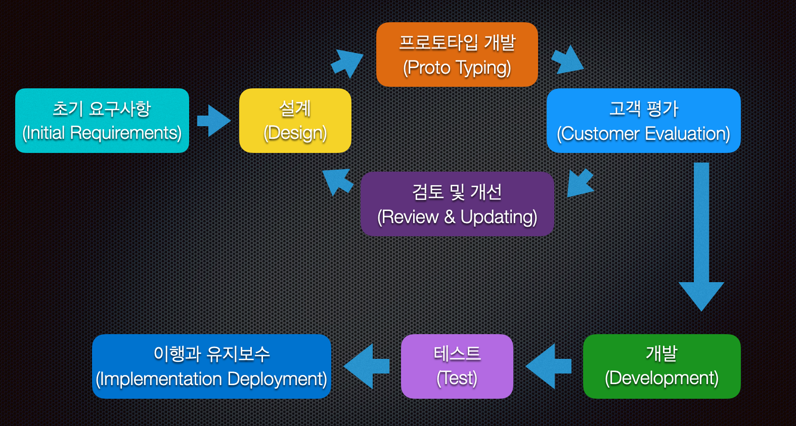
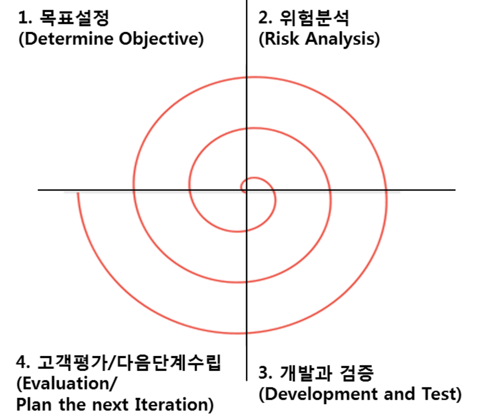
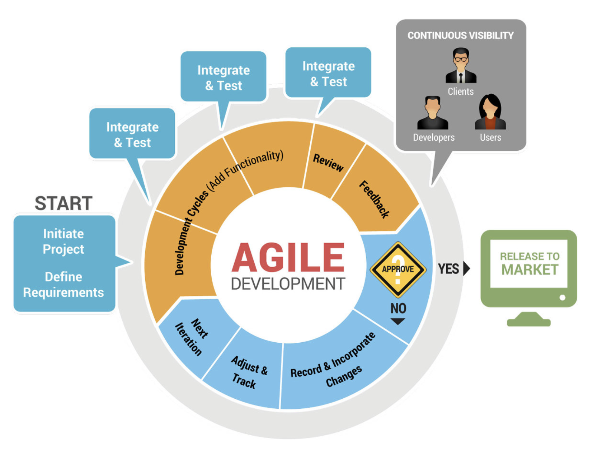

# 요구사항 확인

## 소프트웨어 생명 주기

### 소프트웨어 생명 주기 (Software Life Cycle)
* 소프트웨어 생명 주기는 **_소프트웨어를 개발하기 위한_** 설계, 운용, 유지보수등의 **_과정을 각 단계별로 나눈 것_**
* 소프트웨어 개발 단계, 각 단계별 주요 활동, 활동의 결과에 대한 산출물로 표현
* 대표적인 생명 주기 모형
  - 폭포수 모형
  - 프로토타입 모형
  - 나선형 모형
  - 애자일 모형

### 폭포수 모형 (Waterfall Model)

* 타당성 조사
  - 문제점 파악 및 방안을 제시하여 비용 대비 이익 평가
  - 문제를 분석하는데 시간적 제약
  - 타당성 조사 보고서 작성: 문제 정의, 기술적 경제적 타당성, 비용과 날짜 포함
* 요구 분석
  - 문제에 관한 구체적 기술
  - 문제 해결을 위한 대안
  - 시스템의 기능 요구사항
  - 제약사항
* 설계
  - 요구사항 -> 조직화된 구조의 형태
  - 하드웨어 및 시스템 요구 사항
    - 시스템 아키텍처
    - 프로그램 설계
    - 인터페이스 설계
* 개발
  - 실제 프로그램 개발
  - 단위 테스트
    - 테스트 계획
    - 모듈 테스트 방법
    - 테스트 수준
* 통합과 시스템 테스트
  - 요구사항을 만족하는지 확인
  - 개발 현장 직접 테스트 '알파 테스트'
  - 실제 사용자 테스트 '베타 테스트'
* 이행과 유지보수
  - 수정 유지보수
  - 적응 유지보수
  - 완전 유지보수
  - 예방 유지보수
* 장점
  - 선형 모델로써 단순함과 이해가 편함
  - 체계적 문서화 가능
  - 프로젝트의 진행 상황을 알 수 있음
* 단점
  - 완벽한 문서화를 요구함
  - 변경의 수용이 용이하지 못함
  - 시스템의 동작을 개발 막바지에 확인 가능함
  - 위험 분석을 수행하지 않음
  - 위험 분석을 수행하지 않기 때문에 대형 프로젝트에 적합하지 않음
  - 확장되기가 어려움

### 프로토타입 모형 (Prototype Model, 원형 모형)
실제 개발될 소프트웨어 견본품을 만들어 최종 결과물을 예측하는 모형

* 프로토타입 모형의 특징
  - 사용자 중심의 프로세스 모델
  - 기존 폭포수모델의 피드백 수용에 대한 단점을 보완
  - 고객의 요구사항을 상세히 파악할 수 있음
  - 고객과 의사소통을 진행 할 수 있음
* 장점
  - 제품에 대한 고객의 만족도를 높일 수 있음
  - 의사소통이 원할해 짐
  - 요구사항 수용이 빨라짐
* 단점
  - 프로토타입 개발의 다음 단계로 이동시 폐기 - 비 경제적
  - 반복 진행동안 산출 문서 관리에 소홀
  - 고객이 프로토 타입을 완제품으로 오인하여 불필요하고 과도한 요구를 할 수 있음
* 프로토타입 모델 프로세스 진행시 중요사항
  1. 고객에게 프로토타입에 대한 충분한 설명이 필요
  2. 프로토타입에 추가할 기능에 대한 타당성과 정확성을 확보해야 함
  3. 프로토 탕비 자체로 고객과 소통하고 개선 프로세서를 반복할 수록 문서화를 철저히 해야함

### 나선형 모델 (Spiral Model, 점진적 모형)
여러번의 소프트웨어 개발 과정을 거쳐 점진적으로 개발하는 모형

* 장점
  - 위험 관리로 인해 위험성이 큰 프로젝트를 수행 할 수 있음
  - 고객의 요구사항을 보다 더 상세히 적용 할 수 있음
  - 변경되는 요구사항에 대해서 적용이 가능함
  - 완성품에 대한 고객 만족도와 품질이 높음
* 단점
  - 프로젝트 기간이 오래 걸림
  - 반복 단계가 길어질수록 프로젝트 관리가 어려움
  - '위험관리' 전문가가 필요함

### 애자일 모형 (Agile Model)
요구사항 변화에 유연하게 대응할 수 있도록 일정한 주기를 반복하면서 개발하는 모형

* 어느 특정 개발 방법론이 아니라 좋은 것을 빠르고 낭비 없게 만들기 위해 고객과의 소통에 초점을 맞춘 방법론
* 기업 활동 전반에 걸쳐 사용됨
* 대표적인 개발 모형
  - 스크럼(Scrum)
  - XP(eXtreme Programming)
  - 칸반(Kanban)
  - Lean
  - 기능 중심 개발(FDD; Feature Driven Development)
* 애자일 개발 4가지 핵심 가치
  - 프로세스와 도구 < 개인과 상호작용
  - 문서 < 실행되는 SW
  - 계약 협상 < 고객과 협업
  - 계획 < 변화

### 소프트웨어 공학
소프트웨어의 위기를 극복하기 위한 방안으로 연구된 학문

* 소프트웨어 공학의 기본 원칙
  - 현대적인 프로그래밍 기술을 계속적으로 적용해야 함
  - 개발된 소프트웨어의 품질이 유지되도록 지속적으로 검증해야 함
  - 소프트웨어 개발 관련 사항 및 결과에 대한 명확한 기록을 유지해야 함
